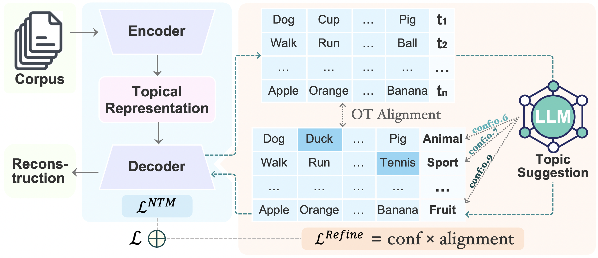

# 🧠 LLM-ITL: Neural Topic Modeling with Large Language Models in the Loop


This repository contains the official implementation of the paper:

> 📄 **Neural Topic Modeling with Large Language Models in the Loop**  
> 🏆 **Accepted to the Main Conference of [ACL 2025](https://2025.aclweb.org/)**  
> 🔗 [Read the paper](https://arxiv.org/abs/2411.08534) 

---

## 📂 Table of Contents

- [Overview](#-overview)
- [Features](#-features)
- [Installation](#-installation)
- [Usage](#-usage)
- [Examples](#-examples)
- [Citation](#-citation)

---

## 📖 Overview
<p align="center">
  
</p>

<p align="center">
  <em>Overview of the LLM-ITL framework.</em>
</p>

**LLM-ITL** is a novel **LLM-in-the-loop framework** that creates a synergistic integration between Large Language Models (LLMs) and Neural Topic Models (NTMs), enhancing topic interpretability while preserving efficient topic and document representation learning.

In this framework:
- NTMs are used to learn global topics and document representations.
- An LLM refines the learned topics via an **Optimal Transport (OT)-based alignment objective**, dynamically adjusting based on the LLM's confidence in suggesting topical words.

LLM-ITL is modular and compatible with many existing NTMs. It significantly improves topic interpretability while maintaining the quality of document representations, as demonstrated through extensive experiments.

---

## ✨ Features

- 🔄 **Flexible integration**: Seamlessly combine a wide range of Large Language Models (LLMs) with various Neural Topic Models (NTMs) through a unified interface.
- ⚙️ **Modular design**: Swap LLMs, NTMs, datasets or evaluation metrics independently — ideal for research experiments and benchmarking.
- 🧠 **Supports various LLMs**: Easily integrates with LLMs such as [LLAMA3](https://huggingface.co/meta-llama/Meta-Llama-3-8B-Instruct), [Mistral](https://huggingface.co/mistralai/Mistral-7B-Instruct-v0.3), [Yi](https://huggingface.co/01-ai/Yi-1.5-9B-Chat), [Phi-3](https://huggingface.co/microsoft/Phi-3-mini-128k-instruct), [Qwen](https://huggingface.co/Qwen/Qwen1.5-32B-Chat), through a flexible, extensible design.
- 📊 **Supports various NTMs**: Easily integrates with NTMs such as [NVDM](https://arxiv.org/abs/1706.00359), [PLDA](https://arxiv.org/abs/1703.01488), [SCHOLAR](https://arxiv.org/abs/1705.09296), [ETM](https://arxiv.org/abs/1907.04907), [NSTM](https://arxiv.org/abs/2008.13537), [CLNTM](https://arxiv.org/abs/2110.12764), [WeTe](https://arxiv.org/abs/2203.01570), [ECRTM](https://arxiv.org/abs/2306.04217), through a flexible, extensible design.

- 📈 **Built-in evaluation metrics**: Includes support for evaluation of **topic coherence**, **topic alignment**, and **topic diversity**, as well as newly proposed joint metrics like [**WALM**](https://example.com), for comprehensive evaluation of topic models.

- 🗂️ **Dataset flexibility**: Compatible with widely used datasets such as **20News**, **AGNews**, **DBpedia** and **R8** — and easy to extend to custom datasets.


---

## 🛠 Installation

```bash
# Clone the repository
git clone https://github.com/Xiaohao-Yang/LLM-ITL.git
cd LLM-ITL

# Create a Python 3.9 virtual environment named 'LLM-ITL'
python3.9 -m venv LLM-ITL
source LLM-ITL/bin/activate       # On Windows: LLM-ITL\Scripts\activate

# Upgrade pip
pip install --upgrade pip

# Install dependencies
pip install -r requirements.txt
```

## 📁 External Files

Some required files are too large to host on GitHub. Please download them from the links below, place them in the specified directories, and **unzip them if needed**.

| File Name         | Description               | Path in Project         | Download Link |
|-------------------|----------------------------|--------------------------|----------------|
| `model.zip`       | LLM-ITL model checkpoint   | `checkpoints/model.pt`   | [Download](https://drive.google.com/file/d/FILE_ID/view?usp=sharing) |
| `dataset.zip`     | Preprocessed dataset       | `data/dataset.jsonl`     | [Download](https://drive.google.com/file/d/FILE_ID/view?usp=sharing) |
| `vocab.txt`       | Vocabulary file            | `resources/vocab.txt`    | [Download](https://drive.google.com/file/d/FILE_ID/view?usp=sharing) |


## 🚀 Usage
### 🔹 Run a Topic Model (Base Model Only)
python main.py --dataset 20News --model nvdm --n_topic 50 --random_seed 1

### 🔹 Run a Topic Model with LLM-ITL
python main.py --dataset 20News --model nvdm --n_topic 50 --random_seed 1 --llm_itl

### 🔹 Run Evaluation
python eval.py --dataset 20News --model nvdm --n_topic 50 --eval_topics

📁 Output Files

🔸 Model checkpoints → LLM-ITL/save_models/

🔸 Learned topics → LLM-ITL/save_topics/

🔸 Evaluation results → LLM-ITL/evaluation_output/


## 📌 Examples
<details>
<summary>🔍 Preview output from <a href="examples/example_run.ipynb">example_run.ipynb</a></summary>
</details>details>

## 🧾 Citation

If you use this code or ideas from our work, please cite the following paper:

> **LLM-in-the-loop: Neural Topic Modeling with Large Language Model**  
> Xiaohao Yang, [Other Authors Here]  
> *Proceedings of the 63rd Annual Meeting of the Association for Computational Linguistics (ACL 2025)*  
> [📄 Paper link](https://arxiv.org/abs/your-paper-id) <!-- replace with actual link -->

```bibtex
@inproceedings{yang2025llmitl,
  title     = {LLM-in-the-loop: Neural Topic Modeling with Large Language Model},
  author    = {Yang, Xiaohao and Other, Author},
  booktitle = {Proceedings of the 63rd Annual Meeting of the Association for Computational Linguistics (ACL)},
  year      = {2025},
  url       = {https://arxiv.org/abs/your-paper-id}  % replace with actual URL
}


